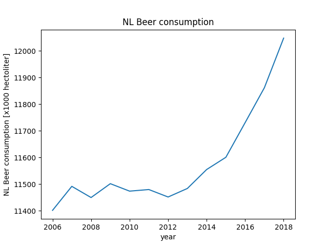

# CS Assignment

The titles of the papers:
  - MCC Van Dyke et al., 2019: *Fantastic yeasts and where to find them: the hidden diversity of dimorphic fungal pathogens*
  - JT Harvey, Applied Ergonomics, 2002: *An analysis of the forces required to drag sheep over various surfaces*
  - DW Ziegler et al., 2005: *The neurocognitive effects of alcohol on adolescents and college students*

## The graphs

From the two above graphs it looks like there is a correlation between WO and the amount of consumed beer.
